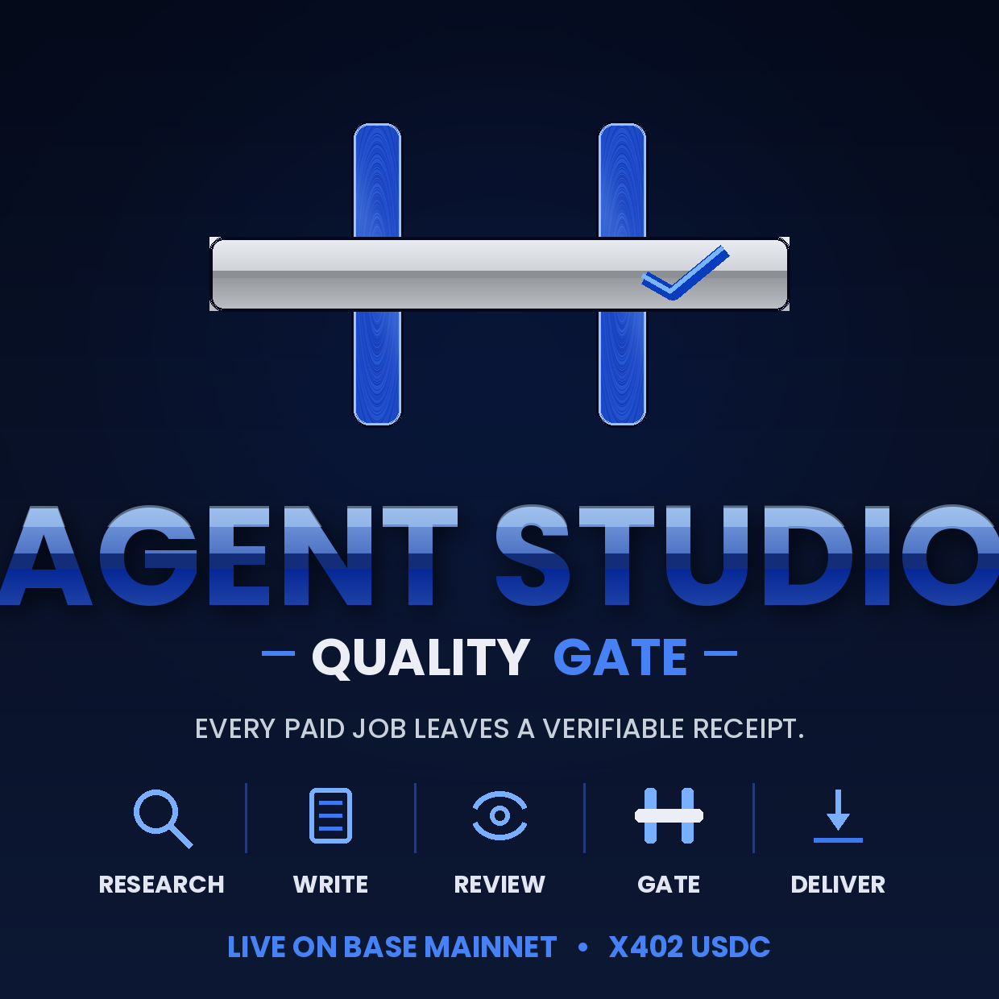

# Agent Studio

Verifiable AI work on Base. A multi-agent pipeline that produces paid Web3
technical documents — where every delivery passes an independent QA gate
and leaves a durable audit trail.

- Live: https://agent-studio.netlify.app
- Docs: [Dynamic Context Layer](docs/DCL.md) · [Context Layer Concept](docs/CONTEXT-LAYER-CONCEPT.md) · [Mock Mode](apps/web/MOCK.md)
- Payments: x402 USDC on Base mainnet, Builder Code bc_ndv5qw7g
- Try the full pipeline in ~3 minutes with ZERO credentials:
  set AS_MOCK=1, DCL_STORE=memory, NEXT_PUBLIC_ENABLE_DCL=true, run dev,
  open /run, use "Load example", generate. Set DCL_GATE_MOCK_VERDICT=fail
  to watch the gate loop and the force-pass warning banner.

## Development

AI-агенти для генерації Web3 документів: Tech Spec · Tokenomics · DeFi Audit Prep.

Повний pipeline: Research → Writer → QA → Revise → Deliver.

### Архітектура

6 агентів, кожен — Edge Function з SSE-стрімінгом (немає таймаутів Netlify):

| Агент | Модель | Призначення |
|-------|--------|-------------|
| Research | Haiku | Аналіз ринку, стеку, конкурентів |
| Writer | Haiku | Генерація 10-секційного документу |
| QA | Sonnet | Перевірка якості, score 1-10 |
| Revise | Haiku | Виправлення за звітом QA |
| Deliver | Haiku | PDF + email через Resend |
| Orchestrate | Haiku/Sonnet | Повний pipeline одним запитом |

### Швидкий старт

#### 1. Завантаж репо

```bash
git clone https://github.com/YOUR_USERNAME/agent-studio.git
cd agent-studio
```

#### 2. Деплой на Netlify

1. netlify.com → **Add new site → Import from Git**
2. Вибери репо `agent-studio`
3. Налаштування збірки заповняться автоматично з `netlify.toml`
4. Додай **Environment Variables** (Site settings → Environment variables):

```
ANTHROPIC_API_KEY           = sk-ant-...
NEXT_PUBLIC_SUPABASE_URL    = https://xxx.supabase.co
NEXT_PUBLIC_SUPABASE_ANON_KEY = eyJ...
SUPABASE_SERVICE_ROLE_KEY   = eyJ...
RESEND_API_KEY              = re_...
NEXT_PUBLIC_APP_URL         = https://YOUR-SITE.netlify.app
```

5. **Deploy site**

#### 3. Supabase міграція

```
Supabase Dashboard → SQL Editor
→ вставити вміст: supabase/migrations/001_agent_studio.sql
→ Run
```

#### 4. Перевірка

Відкрий `https://YOUR-SITE.netlify.app/run` → заповни форму → запусти агентів.

### Локальний запуск

```bash
cd apps/web
npm install
cp .env.example .env.local
# заповни .env.local
npm run dev
# → http://localhost:3000
```

### Структура

```
agent-studio/
├── apps/web/                  # Next.js 15 додаток
│   └── app/api/agents/
│       ├── research/          # Research Agent
│       ├── writer/            # Writer Agent
│       ├── qa/                # QA Agent
│       ├── revise/            # Reviser Agent
│       ├── deliver/           # Delivery Agent
│       └── orchestrate/       # Pipeline Orchestrator
└── supabase/migrations/       # SQL схема
```

### Pipeline

```
Форма → Research (Haiku) → Writer (Haiku) → QA (Sonnet)
                                                  ↓
                                    score < 9 → Revise (Haiku)
                                                  ↓
                                           Deliver (PDF + email)
```

Кожен крок стрімить прогрес через SSE — з'єднання не обривається на довгих запитах.

### Dynamic Context Layer (DCL)

DCL — це шар контролю якості між агентами: класифікація контексту, role-scoped
пакети для кожного агента, обов'язковий **Final QA Gate** (незалежний суддя-модель
перед доставкою, з capped-циклом самокорекції та force-pass із банером-попередженням)
і durable **Context Store** (аудит-трейл кожної генерації в Postgres). Ядро
(`apps/web/lib/dcl/`) домен-агностичне; усі специфіки Agent Studio — в адаптері.

Повний опис, перевірені trace'и та межа домену: **[docs/DCL.md](docs/DCL.md)**.
